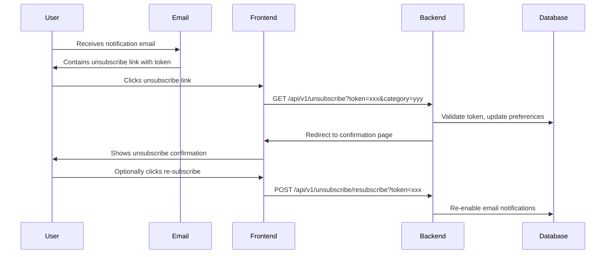

# Email Unsubscribe System Implementation Plan

## Overview

Implement token-based email unsubscribe system that allows users to unsubscribe from email notifications directly from email links without requiring login. Includes per-category unsubscribe, global opt-out, re-subscribe functionality, and compliance features.

## Architecture



## Phase 1: Database Schema & Models

### 1.1 Create UnsubscribeToken Model

**File**: `backend/app/models.py`

- Add `UnsubscribeToken` model with fields:
  - `id` (Integer, primary key)
  - `user_id` (Integer, ForeignKey to users, CASCADE delete, unique - one token per user)
  - `token` (String(255), unique, indexed)
  - `expires_at` (DateTime, timezone-aware)
  - `created_at` (DateTime, timezone-aware, default now)
  - `last_used_at` (DateTime, nullable, timezone-aware) - track last usage (token is reusable)
  - `previous_preferences` (JSON, nullable) - Store previous preference state before unsubscribe (for restoration)
- Add relationship to User model
- Add unique constraint on `user_id` (one token per user)
- Add indexes on `token` and `user_id`
- **Note**: Token is global per user, reused across all emails and categories
- **Note**: `previous_preferences` stores the state before unsubscribe to enable restoration on re-subscribe

### 1.2 Add Global Opt-Out Fields to User Model

**File**: `backend/app/models.py`

- Add `email_notifications_opted_out` (Boolean, default=False)
- Add `email_opt_out_at` (DateTime, nullable, timezone-aware)
- These fields allow quick global opt-out check

### 1.3 Create Database Migration

**File**: `backend/migrations/versions/XXXX_add_unsubscribe_tokens.py`

- Create `unsubscribe_tokens` table with:
  - Foreign key CASCADE to users
  - Unique constraint on `user_id` (one token per user)
- Add `email_notifications_opted_out` and `email_opt_out_at` columns to `users` table
- Set existing users' `email_notifications_opted_out=False`
- Generate initial tokens for existing users (optional, can be lazy-loaded)

## Phase 2: Backend Services

### 2.1 Create UnsubscribeTokenService

**File**: `backend/app/services/unsubscribe_token_service.py` (new)

Service methods:

- `get_or_create_unsubscribe_token(user_id, db)` - Get existing token or create new one
  - Check if user has valid (non-expired) token
  - If exists and valid, return it
  - If expired or missing, generate new token
  - One token per user (reused across all emails and categories)
- `validate_token(token, db)` - Validate and return token object
  - Check if token exists and is not expired
  - **If expired**: Return None (do NOT auto-refresh, user must request new token)
  - If valid: Return token object
- `update_token_usage(token_obj, db)` - Update `last_used_at` timestamp (token is reusable)
- `store_previous_preferences(token_obj, preferences_dict, db)` - Store previous preferences before unsubscribe
- `get_previous_preferences(token_obj)` - Retrieve stored previous preferences for restoration
- `refresh_token(user_id, db)` - Generate new token for user (revokes old one)
- `cleanup_expired_tokens(db, days_old=30)` - Cleanup expired tokens

Token generation:

- Use `secrets.token_urlsafe(32)` for secure tokens
- 30-day expiration (configurable via env var)
- One token per user (stored in database)
- Token is reusable (not one-time use)
- Token can be used for both category-specific and global unsubscribe
- Token is automatically refreshed when expired

### 2.2 Update NotificationService

**File**: `backend/app/services/notification_service.py`

- Add method `check_email_opted_out(user_id, db)` - Check global opt-out flag
- Modify `_get_users_to_notify()` to respect global opt-out
- Add method `get_unsubscribe_token_for_user(user_id, db)` - Get user's unsubscribe token (via UnsubscribeTokenService)
- Update email queuing logic to skip users with global opt-out
- **Update `_queue_email_notification()` to fetch unsubscribe token and include it in SQS message**:
  - Fetch token via `get_unsubscribe_token_for_user()` when queuing email
  - Pass `user_id` and `unsubscribe_token` to `SQSService.send_email_task()`
  - This eliminates the need for Lambda to call backend API to fetch tokens
  - Tokens are encrypted in SQS (KMS encryption), maintaining security

### 2.3 Update EmailService

**File**: `backend/app/services/email_service.py`

- Modify `send_notification_email()` to:
  - Accept `user_id` parameter (optional, for token generation)
  - Accept `db` parameter (optional, for token generation)
  - Accept `unsubscribe_token` parameter (optional, for Lambda-sent emails - token pre-fetched from SQS)
  - **If `unsubscribe_token` is provided**: Use it directly (Lambda case - token from SQS message)
  - **If `user_id` and `db` are provided**: Get or create unsubscribe token via UnsubscribeTokenService (backend case)
  - Add `unsubscribe_token` and `unsubscribe_url` to template context (same token for category-specific)
  - Add `unsubscribe_all_url` to template context (same token, different endpoint)
  - Token is reused across all emails for the same user
- Update `send_digest_email()` similarly
- **Do NOT add unsubscribe links to**:
  - `send_verification_email()` - System email, no unsubscribe needed
  - Admin alert emails (`admin_alert.html`) - Required for admins, no unsubscribe
- Ensure unsubscribe links are included in all **notification** email templates (new_dive, new_dive_site, new_diving_center, new_dive_trip, daily_digest, weekly_digest)

### 2.4 Update SQSService

**File**: `backend/app/services/sqs_service.py`

- Modify `send_email_task()` to:
  - Accept optional `user_id` parameter
  - Accept optional `unsubscribe_token` parameter
  - Include `user_id` and `unsubscribe_token` in SQS message body when provided
  - This allows Lambda to read tokens directly from SQS messages (no API calls needed)
- Update `send_batch_email_tasks()` to support the new fields in batch operations

## Phase 3: API Endpoints

### 3.1 Create Unsubscribe Router

**File**: `backend/app/routers/unsubscribe.py` (new)

Endpoints:

- `GET /api/v1/unsubscribe?token={token}&category={category}` - Unsubscribe from specific category
  - Validate token (same token used for all operations)
  - **If token expired**: Return error, do NOT auto-refresh
  - **Store previous preference state** before disabling (for re-subscribe restoration)
  - Update NotificationPreference (set `enable_email=False` for specified category)
  - Update token's `last_used_at` timestamp (token is reusable)
  - Log unsubscribe event
  - Redirect to frontend confirmation page
- `GET /api/v1/unsubscribe/all?token={token}` - Unsubscribe from all emails
  - Validate token (same token used for all operations)
  - **If token expired**: Return error, do NOT auto-refresh
  - **Store previous preference state** before disabling (for re-subscribe restoration)
  - Set `email_notifications_opted_out=True` on User
  - Set `email_opt_out_at=now()`
  - Disable all email preferences (set `enable_email=False` for all categories)
  - Update token's `last_used_at` timestamp (token is reusable)
  - Log unsubscribe event
  - Redirect to frontend confirmation page
- `GET /api/v1/unsubscribe/confirm?token={token}` - Confirmation page data (JSON)
  - Return unsubscribe status, category info, re-subscribe token
- `POST /api/v1/unsubscribe/resubscribe?token={token}&category={category}` - Re-subscribe
  - Validate token (same token used for unsubscribe and re-subscribe)
  - **Restore previous preferences**: Re-enable email notifications for the category that was previously disabled
  - If global opt-out was used, restore all previous email preferences
  - Clear global opt-out flag if applicable
  - Update token's `last_used_at` timestamp
  - Return success status with restored preferences

**Note**: The internal endpoint `/api/v1/unsubscribe/internal/token/{user_id}` was initially planned for Lambda to fetch tokens, but was removed after optimization. Tokens are now included directly in SQS messages, eliminating the need for this endpoint.

### 3.2 Add Unsubscribe Router to Main App

**File**: `backend/app/main.py`

- Import and include unsubscribe router
- Register routes under `/api/v1/unsubscribe`

### 3.3 Update Notification Preferences Endpoint

**File**: `backend/app/routers/notifications.py`

- Modify preference update logic to respect global opt-out flag
- If user has global opt-out, prevent enabling email notifications
- Add validation to check global opt-out before enabling emails

## Phase 4: Email Template Updates

### 4.1 Update All Email Templates

**Files**: All files in `backend/app/templates/emails/`

For each template (HTML and TXT versions):

- Add unsubscribe section in footer:
  - "Unsubscribe from [category] emails" link with category-specific token
  - "Unsubscribe from all emails" link with global token
  - Keep existing "Manage Preferences" link
- Format: Use consistent styling matching existing footer design
- Ensure unsubscribe links are clearly visible but not intrusive

Template context variables:

- `unsubscribe_url` - Category-specific unsubscribe link (uses same token with category parameter)
- `unsubscribe_all_url` - Global unsubscribe link (uses same token, different endpoint)
- `category` - Current notification category
- `unsubscribe_token` - The user's unsubscribe token (same token for all emails)

### 4.2 Template Structure

**Example footer structure**:

```html
<!-- Footer -->
<p>Unsubscribe from [category] emails: {{ unsubscribe_url }}</p>
<p>Unsubscribe from all emails: {{ unsubscribe_all_url }}</p>
<p><a href="{{ site_url }}/profile/notifications">Manage Preferences</a></p>
```

## Phase 5: Frontend Implementation

### 5.1 Create Unsubscribe Confirmation Page

**File**: `frontend/src/pages/Unsubscribe.js` (new)

- Handle URL parameters: `?token={token}&category={category}&status={success|error}`
- Display confirmation message:
  - Success: "You've been unsubscribed from [category] emails"
  - Error: "Invalid or expired unsubscribe link"
- Show re-subscribe option with button
- Link to preference management page
- Handle both category-specific and global unsubscribe

### 5.2 Create Re-Subscribe Page/Component

**File**: `frontend/src/pages/Resubscribe.js` (new)

- Handle re-subscribe token from URL
- Call POST `/api/v1/unsubscribe/resubscribe?token={token}`
- Display success/error message
- Option to go to preference management

### 5.3 Update App Routes

**File**: `frontend/src/App.js`

- Add route: `/unsubscribe` -> Unsubscribe component
- Add route: `/resubscribe` -> Resubscribe component

### 5.4 Update Preference Management Page

**File**: `frontend/src/pages/ProfileNotifications.js` (if exists)

- Show global opt-out status if applicable
- Display warning if global opt-out is enabled
- Add option to clear global opt-out
- Show per-category email status

## Phase 6: Testing

### 6.1 Backend Tests

**File**: `backend/tests/test_unsubscribe.py` (new)

Test cases:

- Token generation and validation
- Category-specific unsubscribe
- Global unsubscribe (all categories)
- Token expiration handling (expired tokens show error, no auto-refresh)
- Invalid/expired token handling
- Re-subscribe restores previous preferences
- Re-subscribe functionality
- Global opt-out flag behavior
- Unsubscribe respects opt-out flag
- Token cleanup job
- Audit logging

### 6.2 Integration Tests

**File**: `backend/tests/test_unsubscribe_integration.py` (new)

- Full unsubscribe flow (email -> click link -> confirm)
- Re-subscribe flow
- Global opt-out prevents new email notifications
- Email templates include unsubscribe links

### 6.3 Frontend Tests

- Unsubscribe page renders correctly
- Re-subscribe functionality works
- Error handling for invalid tokens
- Redirect handling

### 6.4 Update Existing Tests

**Files**: `backend/tests/test_notifications.py`, `backend/tests/test_email_service.py`

- Update tests to account for unsubscribe tokens in email context
- Test that opted-out users don't receive emails
- Test preference updates respect global opt-out

## Phase 7: Compliance & Audit

### 7.1 Audit Logging

**File**: `backend/app/services/unsubscribe_token_service.py`

- Log all unsubscribe events with:
  - User ID
  - Category (or "all")
  - Timestamp
  - Token used
  - Optional reason (if provided)

### 7.2 Compliance Features

- Ensure unsubscribe works within 10 business days (CAN-SPAM)
- Clear, simple unsubscribe process (GDPR)
- Unsubscribe link in every email (legal requirement)
- Record of unsubscribe requests (audit trail)

### 7.3 Cleanup Job

**File**: `backend/app/services/unsubscribe_token_service.py`

- Add `cleanup_expired_tokens()` method
- Schedule periodic cleanup (via cron or background task)
- Delete tokens older than expiration + grace period

## Implementation Details

### Token Generation

- Use `secrets.token_urlsafe(32)` for secure, URL-safe tokens
- Store in database with expiration
- 30-day expiration (configurable via env var)
- **One token per user** (reused across all emails and categories)
- Token is **reusable** (not one-time use)
- Token is NOT automatically refreshed when expired (expired tokens show error)
- Token can be used for both category-specific and global unsubscribe

### Global Opt-Out Logic

- Check `email_notifications_opted_out` flag first
- If True, skip email sending entirely (faster than checking all preferences)
- Still create website notifications if preferences allow
- Global opt-out takes precedence over category preferences

### Email Template Integration

- Get or create user's unsubscribe token when email is queued (lazy generation)
- Token is reused across all emails for the same user
- Pass token to template context
- Include both category-specific and global unsubscribe links (same token, different endpoints)
- Maintain existing "Manage Preferences" link
- Token is NOT automatically refreshed if expired (expired tokens return error)

### Lambda Email Processing Optimization

**File**: `backend/lambda/email_processor.py`

- **Read `user_id` and `unsubscribe_token` directly from SQS message body** (no API calls needed)
- Pass `unsubscribe_token` directly to `EmailService.send_notification_email()`
- **Removed**: Internal API endpoint `/api/v1/unsubscribe/internal/token/{user_id}` (no longer needed)
- **Removed**: Lambda-to-backend API call code for fetching tokens
- **Benefits**:
  - ⚡ 50% reduction in operations (10 users = 10 SQS messages instead of 10 SQS + 10 API calls)
  - ⚡ Eliminated API latency (no round-trip to backend)
  - ⚡ Reduced backend load (no API requests from Lambda)
  - 🔒 Security maintained (tokens encrypted in SQS with KMS)
  - 📦 Simpler architecture (Lambda code is cleaner)
- **Backward compatibility**: Old SQS messages without tokens will still work (email sent without unsubscribe links, warning logged)

### Security Considerations

- Tokens expire after 30 days (expired tokens show error, no auto-refresh)
- Tokens are reusable (not one-time use) - more convenient for users
- Tokens are cryptographically secure (`secrets.token_urlsafe(32)`)
- One token per user (simpler, fewer tokens in database)
- No user enumeration (invalid tokens return generic error)
- Rate limiting on unsubscribe endpoints (prevent abuse)
- Token usage is tracked via `last_used_at` for audit purposes

## Success Criteria

- [ ] Users can unsubscribe from emails via one-click link (no login required)
- [ ] Users can unsubscribe from all emails via one-click link
- [ ] Users can re-subscribe after unsubscribing
- [ ] All email templates include unsubscribe links
- [ ] Global opt-out flag prevents all email notifications
- [ ] Unsubscribe events are logged for audit
- [ ] Tokens expire after 30 days (expired tokens show error, no auto-refresh)
- [ ] Re-subscribe restores previous preferences (not default settings)
- [ ] One token per user (reused across all emails)
- [ ] Token is reusable (not one-time use)
- [ ] Invalid/expired tokens show appropriate error messages
- [ ] Compliance requirements met (CAN-SPAM, GDPR)
- [ ] Comprehensive test coverage (backend and frontend)
- [ ] Cleanup job removes expired tokens
- [x] **Optimization**: Unsubscribe tokens included in SQS messages (Lambda doesn't need API calls)
- [x] **Performance**: 50% reduction in operations (10 users = 10 SQS messages instead of 20 operations)
- [x] **Architecture**: Removed unnecessary internal API endpoint for token fetching

## Recent Optimizations (2025-12-20)

### Performance Optimization: Include Tokens in SQS Messages

**Problem**: Lambda email processor was making API calls back to the backend to fetch unsubscribe tokens for each email, creating unnecessary latency and backend load.

**Solution**: Unsubscribe tokens are now included directly in SQS messages when queuing email notifications.

**Implementation**:

1. `NotificationService._queue_email_notification()` fetches unsubscribe token and includes it in SQS message
2. `SQSService.send_email_task()` accepts optional `user_id` and `unsubscribe_token` parameters
3. Lambda `email_processor.py` reads tokens from SQS message body (no API calls)
4. Removed internal API endpoint `/api/v1/unsubscribe/internal/token/{user_id}` (no longer needed)

**Benefits**:

- ⚡ **50% reduction in operations**: 10 users = 10 SQS messages (was 10 SQS + 10 API calls)
- ⚡ **Eliminated API latency**: No round-trip to backend for token fetching
- ⚡ **Reduced backend load**: No API requests from Lambda for tokens
- 🔒 **Security maintained**: Tokens encrypted in SQS (KMS encryption)
- 📦 **Simpler architecture**: Lambda code is cleaner, no token fetching logic

**Files Modified**:

- `backend/app/services/notification_service.py`: Fetch and include tokens in SQS messages
- `backend/app/services/sqs_service.py`: Accept and include tokens in message body
- `backend/lambda/email_processor.py`: Read tokens from message, removed API call code
- `backend/app/routers/unsubscribe.py`: Removed internal token endpoint

**Backward Compatibility**: Old SQS messages without tokens will still work (email sent without unsubscribe links, warning logged)

## Files to Create/Modify

**New Files**:

- `backend/app/services/unsubscribe_token_service.py`
- `backend/app/routers/unsubscribe.py`
- `backend/migrations/versions/XXXX_add_unsubscribe_tokens.py`
- `backend/tests/test_unsubscribe.py`
- `backend/tests/test_unsubscribe_integration.py`
- `frontend/src/pages/Unsubscribe.js`
- `frontend/src/pages/Resubscribe.js`

**Modified Files**:

- `backend/app/models.py` - Add UnsubscribeToken model, update User model
- `backend/app/services/notification_service.py` - Add opt-out checks, token generation, include tokens in SQS messages
- `backend/app/services/email_service.py` - Add token generation, update context, accept pre-fetched tokens
- `backend/app/services/sqs_service.py` - Accept and include tokens in SQS message body
- `backend/lambda/email_processor.py` - Read tokens from SQS messages, removed API call code
- `backend/app/main.py` - Include unsubscribe router
- `backend/app/routers/notifications.py` - Respect global opt-out
- `backend/app/templates/emails/new_dive*.html/txt` - Add unsubscribe links (notification templates)
- `backend/app/templates/emails/new_dive_site*.html/txt` - Add unsubscribe links
- `backend/app/templates/emails/new_diving_center*.html/txt` - Add unsubscribe links
- `backend/app/templates/emails/new_dive_trip*.html/txt` - Add unsubscribe links
- `backend/app/templates/emails/daily_digest*.html/txt` - Add unsubscribe links
- `backend/app/templates/emails/weekly_digest*.html/txt` - Add unsubscribe links
- **Do NOT modify**: `email_verification.*`, `admin_alert.*` (no unsubscribe links)
- `frontend/src/App.js` - Add unsubscribe routes
- `backend/tests/test_notifications.py` - Update for opt-out
- `backend/tests/test_email_service.py` - Update for tokens

**Removed Files/Endpoints**:

- Internal endpoint `/api/v1/unsubscribe/internal/token/{user_id}` - Removed after optimization (tokens now in SQS messages)