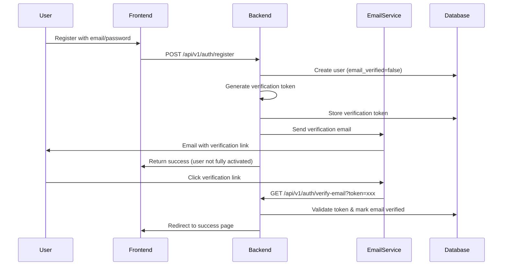

# Email Validation System

Implementation Plan

## Overview

Add email validation for new user registrations using unique verification links sent via email. Users authenticating with Google OAuth are exempt since Google already verifies email addresses.

## Architecture

## Phase 1: Database Schema & Models

### 1.1 Add email_verified field to User model

- **File**: `backend/app/models.py`

- Add `email_verified` boolean field (default=False) to User model

- Add `email_verified_at` timestamp field (nullable)

### 1.2 Create EmailVerificationToken model

- **File**: `backend/app/models.py`

- New model with fields:

- `id` (primary key)
- `user_id` (foreign key to users)

- `token` (unique string, indexed)

- `expires_at` (datetime)

- `used_at` (nullable datetime)

- `created_at` (datetime)

### 1.3 Create database migration

- **File**: `backend/migrations/versions/XXXX_add_email_verification.py`

- Add `email_verified` and `email_verified_at` columns to users table

- Create `email_verification_tokens` table

- Set existing users' `email_verified=True` (backward compatibility)

- Set Google OAuth users' `email_verified=True` automatically

- **Note**: Do NOT modify `enabled` field - it remains separate for admin control

## Phase 2: Backend Core Services

### 2.1 Create email verification service

- **File**: `backend/app/services/email_verification_service.py`
- Functions:

- `generate_verification_token(user_id, db)` - Create secure token using `secrets.token_urlsafe(32)`

- `create_verification_token(user_id, db)` - Store token in database with 24-hour expiration

- `verify_token(token, db)` - Validate token, mark as used, update user

- `is_token_valid(token, db)` - Check if token exists and not expired/used

- `resend_verification_email(user_id, db)` - Generate new token and send email

### 2.2 Create email verification templates

- **Files**: 

- `backend/app/templates/emails/email_verification.html`

- `backend/app/templates/emails/email_verification.txt`

- Template variables:

- `verification_link` - Full URL with token
- `user_email` - User's email

- `expires_in_hours` - Token expiration time

- `site_name`, `site_url`

### 2.3 Add verification email sending to EmailService

- **File**: `backend/app/services/email_service.py`

- Add method: `send_verification_email(user_email, verification_token)`
- Use existing template rendering infrastructure

## Phase 3: Backend API Endpoints

### 3.1 Update registration endpoint

- **File**: `backend/app/routers/auth.py`

- Modify `/register` endpoint:

- Set `email_verified=False` for new users

- Keep `enabled=True` by default (admin can disable later if needed)

- Generate verification token after user creation
- Send verification email

- Return response indicating email verification required

- **Optional**: Don't create tokens immediately (user must verify first)

### 3.2 Create email verification endpoint

- **File**: `backend/app/routers/auth.py`
- New endpoint: `GET /api/v1/auth/verify-email?token={token}`
- Validate token, mark email as verified, redirect to frontend success page

- Handle expired/invalid tokens with appropriate error messages

### 3.3 Create resend verification endpoint

- **File**: `backend/app/routers/auth.py`
- New endpoint: `POST /api/v1/auth/resend-verification`

- **Does NOT require authentication** (user can't log in without verification)

- Request body: `{ "email": "user@example.com" }`

- Rate limit: 3 requests per day per email address (prevent abuse)

- Security considerations:
  - Don't reveal if email exists or is already verified (prevent email enumeration)
  - Always return success message even if email doesn't exist or is already verified
  - Log attempts for monitoring abuse

- Logic:
  - Find user by email
  - If user doesn't exist or email already verified: return success (don't reveal status)
  - If user exists and not verified: revoke old tokens, generate new token, send email
  - Return generic success message: "If the email exists and is not verified, a new verification email has been sent."

### 3.4 Update login endpoint (optional)

- **File**: `backend/app/routers/auth.py`

- Add optional check: Block login if `email_verified=False` (configurable via env var)

- Return clear error message directing user to verify email

- **Important**: Keep existing `enabled` field check - this is separate from email verification
  - `enabled=False` = Admin has disabled user (for abuse prevention)
  - `email_verified=False` = User hasn't verified email yet
  - Login should check BOTH: user must be `enabled=True` AND `email_verified=True` (if verification required)

### 3.5 Update Google OAuth flow

- **File**: `backend/app/google_auth.py`

- In `get_or_create_google_user()`: Set `email_verified=True` for Google users

- Google already verifies emails, so skip validation

### 3.6 Update schemas

- **File**: `backend/app/schemas.py`

- Add `email_verified` to `UserResponse` schema
- Add `ResendVerificationRequest` schema (if needed)

## Phase 4: Frontend Implementation

### 4.1 Update registration flow

- **File**: `frontend/src/pages/Register.js`

- After successful registration:

- Show message: "Registration successful! Please check your email to verify your account."

- Don't automatically log user in (if verification required before login)

- Or log in but show banner: "Please verify your email"

### 4.2 Create email verification page

- **File**: `frontend/src/pages/VerifyEmail.js`

- Handle verification token from URL query parameter
- Call verification API endpoint

- Show success/error states

- Redirect to login or home page on success

### 4.3 Add verification status to user context

- **File**: `frontend/src/contexts/AuthContext.js`

- Include `email_verified` in user state

- Check verification status on login

### 4.4 Create verification banner/notification

- **File**: `frontend/src/components/EmailVerificationBanner.js`

- Show banner if user is logged in but `email_verified=false`

- Include "Resend verification email" button

- Dismissible (store dismissal in localStorage)

### 4.5 Update user profile/settings

- Show email verification status

- Add "Resend verification email" option if not verified

- **Note**: Since users can't log in without verification, resend functionality should also be available:
  - On the login page (if user tries to log in but email not verified)
  - On a dedicated "resend verification" page accessible without login
  - In the verification email itself (if user receives it but link expires)

## Phase 5: Testing & Edge Cases

### 5.1 Backend tests

- **File**: `backend/tests/test_email_verification.py`

- Test token generation and storage

- Test token verification (valid, expired, used, invalid)

- Test email sending on registration

- Test resend verification endpoint

- Test Google OAuth users skip verification
- Test rate limiting on resend (3 requests per day per email)

- Test that `enabled` field is independent of `email_verified`:
  - User can be `enabled=True` but `email_verified=False`
  - User can be `enabled=False` but `email_verified=True` (admin disabled)
  - Login checks both fields appropriately

### 5.2 Frontend tests

- Test verification page with valid/invalid tokens

- Test registration flow with email verification

- Test resend verification functionality

### 5.3 Edge cases

- Expired tokens (24 hours)

- Already used tokens
- Multiple tokens per user (revoke old on new generation)

- User changes email (require re-verification)
- Email delivery failures (graceful degradation)

- Resend verification without authentication:
  - Rate limiting by email address: 3 requests per day (not user ID)
  - Prevent email enumeration attacks (don't reveal if email exists)
  - Handle case where user doesn't exist gracefully
  - Handle case where email already verified gracefully

## Phase 6: Configuration & Documentation

### 6.1 Environment variables

- `EMAIL_VERIFICATION_REQUIRED` (default: true) - Require verification before login

- `EMAIL_VERIFICATION_TOKEN_EXPIRY_HOURS` (default: 24)

- `FRONTEND_URL` - For building verification links (should already exist)

### 6.2 Update documentation

- Update API documentation with new endpoints

- Add email verification flow to user guide

- Document Google OAuth exemption

## Implementation Notes

- **Security**: Use `secrets.token_urlsafe(32)` for cryptographically secure tokens

- **Token Expiration**: 24 hours default (configurable)

- **Rate Limiting**: Prevent abuse of resend endpoint

- **Backward Compatibility**: Existing users marked as verified

- **Google OAuth**: Automatically verified (no email validation needed)

- **Email Templates**: Follow existing template structure and styling

- **Database**: Use Alembic migrations following numerical naming convention

- **Field Separation**: `enabled` and `email_verified` serve different purposes:
  - `enabled` (Boolean): Admin control to disable users for abuse prevention - independent of email verification
  - `email_verified` (Boolean): User has verified they own the email address
  - Both fields should be checked during login if email verification is required
  - Admins can disable users (`enabled=False`) even if they've verified their email

## Files to Modify/Create

### Backend

- `backend/app/models.py` - Add fields and EmailVerificationToken model

- `backend/app/schemas.py` - Add email_verified to schemas

- `backend/app/routers/auth.py` - Update registration, add verification endpoints

- `backend/app/google_auth.py` - Set email_verified=True for Google users

- `backend/app/services/email_verification_service.py` - New service file

- `backend/app/services/email_service.py` - Add verification email method

- `backend/app/templates/emails/email_verification.html` - New template

- `backend/app/templates/emails/email_verification.txt` - New template

- `backend/migrations/versions/XXXX_add_email_verification.py` - New migration
- `backend/tests/test_email_verification.py` - New test file

### Frontend

- `frontend/src/pages/Register.js` - Update registration flow

- `frontend/src/pages/VerifyEmail.js` - New verification page
- `frontend/src/contexts/AuthContext.js` - Add email_verified to state

- `frontend/src/components/EmailVerificationBanner.js` - New component